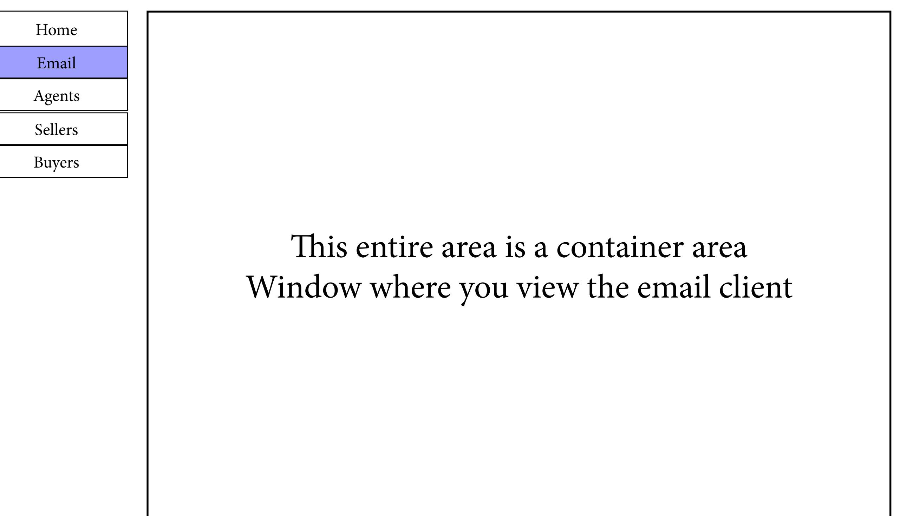
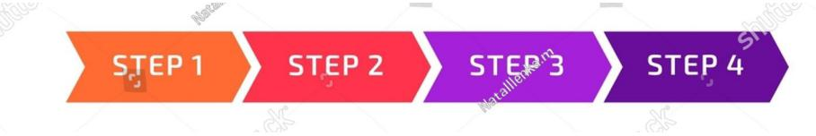

# Welcome {Broker Name} to Your Customized Dashboard

| Home          |
|---------------|
| Email         |
| Agents        |
| Sellers       |
| <b>Buyers</b> |

| <b>Total Active Listings</b> | Is a number |
|------------------------------|-------------|
| Total under contrac          | Is a number |
| New Listings This Month      | Is a number |
| Non Disclosure agreement     | Is a number |
| Total Closed Deals (YTD)     | Is a number |
|                              |             |
|                              |             |
|                              |             |

#### Table below will be scrollable

# Welcome {Broker/Agent Name} to Your Customized Dashboard

|         | Add An Agent                   | Delete An Agent    | Archive An Agent      |                         |
|---------|--------------------------------|--------------------|-----------------------|-------------------------|
| Home    | Agent                          | Number of Listings | Number Under Contract | <b>Closings to Date</b> |
|         | Name - Click loads agent below | Is a number        | Is a number           | $\!$ is a number        |
| Email   |                                |                    |                       |                         |
|         |                                |                    |                       |                         |
| Agents  |                                |                    |                       |                         |
| Sellers |                                |                    |                       |                         |
|         |                                |                    |                       |                         |
| Buyers  |                                |                    |                       |                         |
|         |                                |                    |                       |                         |
|         |                                |                    |                       |                         |
|         |                                |                    |                       |                         |
|         |                                |                    |                       |                         |
|         |                                |                    |                       |                         |
|         |                                |                    |                       |                         |
|         |                                |                    |                       |                         |
|         |                                |                    |                       |                         |
|         |                                |                    |                       |                         |
|         |                                |                    |                       |                         |
|         |                                |                    |                       |                         |
|         |                                |                    |                       |                         |
|         |                                |                    |                       |                         |
|         |                                |                    |                       |                         |
|         |                                |                    |                       |                         |
|         |                                |                    |                       |                         |
|         |                                |                    |                       |                         |
|         |                                |                    |                       |                         |

Broker can add or delete agents pages. Brokers page will show all seller and buyers when clicked along with which agent is assigned to them. Agents page will only show seller or buyer they are assigned,

# Welcome {Broker/Agent Name} to Your Customized Dashboard

|               | Seller | Listing Date | Under Contract Yes / No | Closing Date |
|---------------|--------|--------------|-------------------------|--------------|
| Home          |        |              |                         |              |
|               |        |              |                         |              |
| Email         |        |              |                         |              |
|               |        |              |                         |              |
| Agents        |        |              |                         |              |
|               |        |              |                         |              |
| Sellers       |        |              |                         |              |
|               |        |              |                         |              |
| <b>Buyers</b> |        |              |                         |              |

# Welcome {seller Name} to Your Customized Dashboard

| Home                     |
|--------------------------|
| <b>Email Agent</b>       |
| <b>Listing Agreement</b> |
| Questionnaire            |
| <b>Upload Docs</b>       |
| <b>Buyer Activity</b>    |
|                          |

Purchase Agreement Due Diligence Closing Docs Pre Close Checklist After The Sale

Dynamic Progress Bar that shows where the transaction is at. Steps are labeled

Your dynamic progress bar on top will show you the progress on The sell of your business in real time as it progresses.

Please select from the menu items on the left. From your custom seller's dashboard to do the following:

1. Download your listing agreement

2. Fill out your business questionnaire Online.

3. Upload your Financial documents.

4. Buyer Activity: Up to the minute updates on buyers.

5. Download your purchase contract (once we have an accepted buyer offer.

6. Upload due diligence documents.

7. Download Closing document once we are closed.

8. After the Sale: Learn about ways mitigate taxes on the proceeds,

Table below will be scrollable

# Welcome {Broker/Agent Name} to Your Customized Dashboard

|               | Buyer | Signed NDA Date | Under Contract Yes / No | Closing Date |
|---------------|-------|-----------------|-------------------------|--------------|
| Home          |       |                 |                         |              |
|               |       |                 |                         |              |
| Email         |       |                 |                         |              |
|               |       |                 |                         |              |
| Agents        |       |                 |                         |              |
|               |       |                 |                         |              |
| Sellers       |       |                 |                         |              |
|               |       |                 |                         |              |
| <b>Buyers</b> |       |                 |                         |              |

Broker can add or delete agents pages. Brokers page will show all seller and buyers when clicked along with which agent is assigned to them. Agents page will only show seller or buyer they are assigned,

Due Diligence Pre Close Checklist After The Sale Closing Docs I ultuase Contract

Your dynamic progress bar on top will show you the progress on The purchase of your business in real time as it progresses.

Please select from the menu items on the left. From your custom buyer's dashboard to do the following:

Welcome {Buyer's Name} to Your Customized Dashboard

Dynamic Progress Bar that shows where the transaction is at. Steps are labeled

| Home                       |
|----------------------------|
| <b>Email Agent</b>         |
| Non Disclosure             |
| <b>Financial Statement</b> |
| CBR/CIM                    |
| <b>Upload Docs</b>         |
| $D$ urchase Contract       |

1. Email the broker or agent

2. Fill out a Non Disclosure agreement online

3. Fill out a simple financial statement online 4. Download a CBR or CIM for the business your interested in.

5. Upload documents

6. Download your purchase contract (once we have an accepted offer.)

7. Request & Download Due Diligence documents.

8. Checklist: Check off your to do list. See if others have done theirs.

9. Download Closing document once we are closed.

10. After the Sale: Tips to make your tranistion smoother, or Tips to ramp up your business. Contacts info for services they might need.