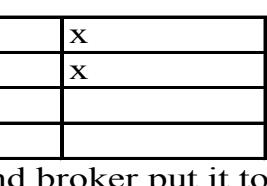

Your dynamic progress bar on top will show you the progress on The purchase of your business in real time as it progresses.

Please select from the menu items on the left. From your custom buyer's dashboard to do the following:

### Welcome {Buyer's Name} to Your Customized Dashboard

Dynamic Progress Bar that shows where the transaction is at. Steps are labeled

| Home                       |  |  |  |  |
|----------------------------|--|--|--|--|
| Email Agent                |  |  |  |  |
| Non Disclosure             |  |  |  |  |
| <b>Financial Statement</b> |  |  |  |  |
| <b>CBR/CIM</b>             |  |  |  |  |
| <b>Upload Docs</b>         |  |  |  |  |
| <b>Purchase Contract</b>   |  |  |  |  |
| Due Diligence              |  |  |  |  |
| <b>Pre Close Checklist</b> |  |  |  |  |
| <b>Closing Docs</b>        |  |  |  |  |
| After The Sale             |  |  |  |  |

- 1. Email the broker or agent
- 2. Fill out a Non Disclosure agreement online
- 3. Fill out a simple financial statement online
- 4. Download a CBR or CIM for the business your interested in.
- 5. Upload documents
- 6. Download your purchase contract (once we have an accepted offer.)
- 7. Request & Download Due Diligence documents.
- 8. Checklist: Check off your to do list. See if others have done theirs.
- 9. Download Closing document once we are closed.

10. After the Sale: Tips to make your tranistion smoother, or Tips to ramp up your business. Contacts info for services they might need.

Dynamci Progress Bar that shows where the transaction is at. Steps are labeled

| Home                       |  |  |  |  |
|----------------------------|--|--|--|--|
| Email Agent                |  |  |  |  |
| <b>Non Disclosure</b>      |  |  |  |  |
| <b>Financial Statement</b> |  |  |  |  |
| <b>CBR/CIM</b>             |  |  |  |  |
| <b>Upload Docs</b>         |  |  |  |  |
| <b>Purchase Contract</b>   |  |  |  |  |
| Due Diligence              |  |  |  |  |
| <b>Pre Close Checklist</b> |  |  |  |  |
| <b>Closing Docs</b>        |  |  |  |  |
| After The Sale             |  |  |  |  |
|                            |  |  |  |  |

## This entire area is a container area Window where you view the email client

Dynamic Progress Bar that shows where the transaction is at. Steps are labeled

Home

### Non Disclosure Due Diligence Upload Docs Financial Statement CBR/CIM Pre Close Checklist After The Sale Closing Docs Email Agent Purchase Contract

# This would be a non disclosure form that would be filled out then signed electronically.

Dynamic Progress Bar that shows where the transaction is at. Steps are labeled

| Home                       |  |  |  |  |
|----------------------------|--|--|--|--|
| Email Agent                |  |  |  |  |
| <b>Non Disclosure</b>      |  |  |  |  |
| <b>Financial Statement</b> |  |  |  |  |
| CBR/CIM                    |  |  |  |  |
| <b>Upload Docs</b>         |  |  |  |  |
| <b>Purchase Contract</b>   |  |  |  |  |
| Due Diligence              |  |  |  |  |
| <b>Pre Close Checklist</b> |  |  |  |  |
| <b>Closing Docs</b>        |  |  |  |  |
| After The Sale             |  |  |  |  |
|                            |  |  |  |  |

This would be a form that would be filled out then signed electronically. I would provide the format and information. Once filled out they would submit the form and the broker could see it on their side.

Dynamic Progress Bar that shows where the transaction is at. Steps are labeled

| Home                       |
|----------------------------|
| <b>Email Agent</b>         |
| Non Disclosure             |
| <b>Financial Statement</b> |
| <b>CBR/CIM</b>             |
| <b>Upload Docs</b>         |
| <b>Purchase Contract</b>   |
| Due Diligence              |
| <b>Pre Close Checklist</b> |
| <b>Closing Docs</b>        |
| After The Sale             |
|                            |

This will just be a download button. When clicked it will download the CBR/CIM that I will create, or the system will create automatically from the seller questionnaire, financial docs and photos. Message in content area will be: "You Document is downloading. Please check your downloads folder after the download is complete." Thank You!

Dynamic Progress Bar that shows where the transaction is at. Steps are labeled

### Non Disclosure Due Diligence Upload Docs Financial Statement CBR/CIM Home Pre Close Checklist After The Sale Closing Docs Email Agent Purchase Contract

Dynamic Progress Bar that shows where the transaction is at. Steps are labeled

| Home                       |
|----------------------------|
| Email Agent                |
| <b>Non Disclosure</b>      |
| Financial Statement        |
| <b>CBR/CIM</b>             |
| <b>Upload Docs</b>         |
| <b>Purchase Contract</b>   |
| Due Diligence              |
| <b>Pre Close Checklist</b> |
| <b>Closing Docs</b>        |
| After The Sale             |
|                            |

This will just be a download button. When clicked it will download the Purchase Contract that I will create and have he seller sign. Message in content area will be: "You Document is downloading. Please check your downloads folder after the download is complete." Thank You!

#### Due Diligence: please requested documents

Please check box to request documents. When ready you can click file name to download

| File Name | Check box | File Name | Check box |
|-----------|-----------|-----------|-----------|
| File Name | Check box | File Name | Check box |
| File Name | Check box | File Name | Check box |
| File Name | Check box | File Name | Check box |
| File Name | Check box | File Name | Check box |
| File Name | Check box | File Name | Check box |
| File Name | Check box | File Name | Check box |
| File Name | Check box | File Name | Check box |
|           |           |           |           |
|           |           |           |           |
|           |           |           |           |
|           |           |           |           |
|           |           |           |           |

### Welcome {Buyer's Name} to Your Customized Dashboard

Dynamic Progress Bar that shows where the transaction is at. Steps are labeled

| Home                       |
|----------------------------|
| Email Agent                |
| Non Disclosure             |
| <b>Financial Statement</b> |
| <b>CBR/CIM</b>             |
| <b>Upload Docs</b>         |
| <b>Purchase Contract</b>   |
| Due Diligence              |
| <b>Pre Close Checklist</b> |
| <b>Closing Docs</b>        |
| After The Sale             |

Dynamic Progress Bar that shows where the transaction is at. Steps are labeled

| Home                       |
|----------------------------|
| <b>Email Agent</b>         |
| <b>Non Disclosure</b>      |
| <b>Financial Statement</b> |
| <b>CBR/CIM</b>             |
| <b>Upload Docs</b>         |
| <b>Purchase Contract</b>   |
| Due Diligence              |
| <b>Pre Close Checklist</b> |
| Closing Docs               |
| After The Sale             |
|                            |

|                                                                               | <b>Buyer</b> | <b>Seller</b>              |
|-------------------------------------------------------------------------------|--------------|----------------------------|
| A. Letter Of Intent                                                           | $\mathbf X$  |                            |
| 1. Buyer offer                                                                |              |                            |
| 2. Seller counter                                                             |              | $\mathbf x$                |
| 3. Negotiate mutual agreement                                                 |              | $\mathbf x$                |
| 4. Buyer provides Earnest Money                                               | $\mathbf X$  |                            |
| 5. Broker deposits Earnest Money                                              | $\mathbf x$  |                            |
| <b>B. Asset Purchase Agreement</b> 1. Buyer offer                          |              | Buyer and broker put it to |
| Attorney review a.                                                         | $\mathbf X$  |                            |
| <b>Accountant review</b> $b1$                                              | $\mathbf X$  |                            |
| 2. Seller counter                                                             |              | $\mathbf X$                |
| Attorney review a.                                                         |              | $\mathbf X$                |
| <b>Accountant review</b> $b_{-}$                                           |              | $\mathbf X$                |
| 3. Negotiate and execute mutual agreement                                     | $\mathbf x$  | $\mathbf X$                |
| C. Exhibits 1. Current Furniture, Fixtures & Equipment List ("Asset List") | Seller       |                            |
| 2. Seller's financial information                                             |              | $\mathbf X$                |
| 3. Buyer's financial information                                              | $\mathbf X$  |                            |
| 4. Contract Rights                                                            |              | $\mathbf X$                |
| 5. Other:                                                                     |              |                            |
| 6. Other:                                                                     |              |                            |
| 7. Other:                                                                     |              |                            |
| D. Asset Purchase Agreement Contingencies 1. Real Property Lease           | Seller       |                            |
| a. Seller contacts landlord                                                   |              | $\mathbf x$                |
| b. Buyer meeting with landlord                                                | $\mathbf X$  |                            |
| c. Preparation of lease documents                                             | $\mathbf X$  |                            |
| 1. Lease assignment or new lease                                              | $\mathbf X$  |                            |
| a. Seller's security deposit                                                  |              |                            |
| b. Buyer's security deposit                                                   |              |                            |
| c. Rent proration                                                             |              | X                          |
| d. Seller walk thru with landlord and/or Buyer                                | $\mathbf x$  | $\mathbf X$                |
| 2. Conditional lease assignment                                               |              |                            |
| 3. Guaranty of lease                                                          | $\mathbf X$  |                            |
|                                                                               | <b>Buyer</b> | <b>Seller</b>              |
| 2. Right of Inspection                                                        | $\mathbf X$  |                            |
| a. Buyer provide list of due diligence requirements                           | $\mathbf X$  | $\mathbf x$                |
| b. Buyer & Seller agree on plan of action to satisfy contingencies            | $\mathbf X$  | $\mathbf X$                |
| 1. Financials                                                                 | $\mathbf X$  | $\mathbf X$                |
| 2. Premises inspections                                                       | $\mathbf X$  | $\mathbf X$                |

**CHECKLIST:**  $\alpha$  before the closing of the contract of the contract of the contract of the contract of the contract of the contract of the contract of the contract of the contract of the contract of the contract of the co er/Broker) checks something off, it is then check off on each persons checklist. I will provide a custom check list. It should be dynamic. When one party (Seller/Buy-

Dynamic Progress Bar that shows where the transaction is at. Steps are labeled

| Home                       |
|----------------------------|
| <b>Email Agent</b>         |
| Non Disclosure             |
| <b>Financial Statement</b> |
| CBR/CIM                    |
| <b>Upload Docs</b>         |
| <b>Purchase Contract</b>   |
| Due Diligence              |
| Pre Close Checklist        |
| <b>Closing Docs</b>        |
| After The Sale             |
|                            |

This will just be a download button. When clicked it will download the Closing Documents. Nothing will happen when clicked until the closing document are attached by the broker after the sale. Message in content area will be: "You Documents are downloading. Please check your downloads folder after the download is complete." Thank You!

Dynamic Progress Bar that shows where the transaction is at. Steps are labeled

#### This will be informational only in this scrollable window.

After the Sale: Tips & Advice for Buyers

Congratulations on Your Purchase! Now that you've acquired your business, here are some important next steps to ensure a smooth transition and long-term success.

1. Secure Your Transition Plan

Follow the Transition Agreement – If the seller agreed to assist for a set period, maximize this time by learning everything you can. Build Rapport with Key Stakeholders – Employees, customers, and suppliers need confidence in your leadership. Document Critical Processes – Ensure you have clear documentation of all operational procedures. 2. Review Financial & Legal Aspects

Reconcile Accounts – Verify bank accounts, merchant accounts, payroll systems, and accounts payable/receivable. Confirm Business Licenses & Permits – Ensure all legal requirements are met in your name. Review Tax Obligations – Understand upcoming tax deadlines and ensure compliance. 3. Retain Key Employees & Culture

Meet with Staff – Introduce yourself, share your vision, and address concerns. Retain Institutional Knowledge – Long-term employees have valuable insights—learn from them. Implement Gradual Changes – Sudden, drastic changes can disrupt operations and morale. 4. Strengthen Customer & Supplier Relationships

Communicate with Existing Customers – Reassure them that business will continue smoothly. Understand Your Supplier Agreements – Ensure you maintain good terms with existing suppliers. Evaluate Customer Feedback – Look for ways to enhance the business based on existing feedback. 5. Implement Systems & Improvements

Assess Technology & Software – Upgrade outdated systems where necessary. Review Inventory & Supply Chain – Ensure smooth fulfillment and adjust ordering as needed. Monitor Cash Flow Closely – Avoid unnecessary spending until you fully understand revenue patterns. 6. Develop a Long-Term Strategy

Set Clear Goals – Define short-term and long-term objectives. Measure Key Metrics – Track performance indicators like revenue, profit margins, and customer retention. Plan for Growth – Identify opportunities for expansion or new revenue streams. 7. Stay Connected with Professional Support

Work with a Business Mentor or Coach – Gain insights from experienced professionals. Maintain Legal & Accounting Support – A good lawyer and accountant can help you avoid costly mistakes. Network with Industry Peers – Join local or national business groups for support and connections. 8. Take Care of Yourself

Delegate Responsibilities – Don't try to do everything yourself. Stay Organized – Keep track of tasks, deadlines, and progress. Be Patient & Adaptable – Every transition comes with challenges—stay flexible and proactive.