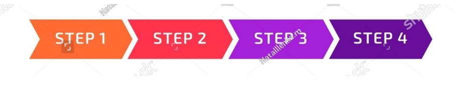
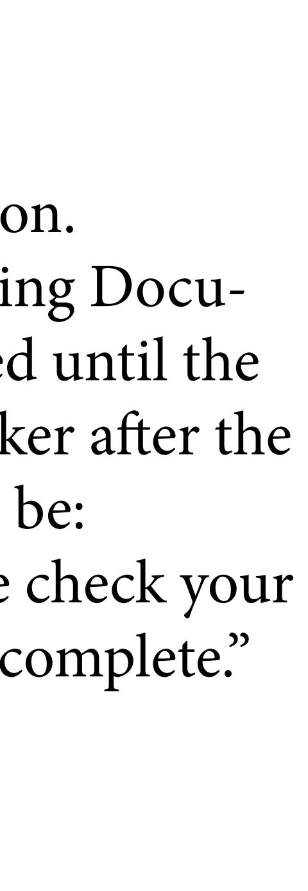

| Home                     |
|--------------------------|
| Email Agent              |
| <b>Listing Agreement</b> |
| Questionnaire            |
| <b>Upload Docs</b>       |
| <b>Buyer Activity</b>    |
| Purchase Agreement       |
| Due Diligence            |
| Pre Close Checklist      |
| <b>Closing Docs</b>      |
| After The Sale           |
|                          |

Dynamic Progress Bar that shows where the transaction is at. Steps are labeled

Your dynamic progress bar on top will show you the progress on The sell of your business in real time as it progresses.

Please select from the menu items on the left. From your custom seller's dashboard to do the following:

- 1. Download your listing agreement
- 2. Fill out your business questionnaire Online.
- 3. Upload your Financial documents.
- 4. Buyer Activity: Up to the minute updates on buyers.
- 5. Download your purchase contract (once we have an accepted buyer offer.
- 6. Upload due diligence documents.
- 7. Download Closing document once we are closed.
- 8. After the Sale: Learn about ways mitigate taxes on the proceeds,

Dynamic Progress Bar that shows where the transaction is at. Steps are labeled

## This entire area is a container area Window where you view the email client

| Home                       |
|----------------------------|
| Email Agent                |
| Listing Agreement          |
| Questionnaire              |
| <b>Upload Docs</b>         |
| <b>Buyer Activity</b>      |
| <b>Purchase Contract</b>   |
| Due Diligence              |
| <b>Pre Close Checklist</b> |
| <b>Closing Docs</b>        |
| After The Sale             |
|                            |

Dynamic Progress Bar that shows where the transaction is at. Steps are labeled

This will just be a download button. When clicked it will download the listing agreement that I will create and have he seller sign. Message in content area will be:

"You Document is downloading. Please check your downloads folder after the download is complete." Thank You!

| Home                     |
|--------------------------|
| Email Agent              |
| <b>Listing Agreement</b> |
| Questionnaire            |
| <b>Upload Docs</b>       |
| <b>Buyer Activity</b>    |
| <b>Purchase Contract</b> |
| Due Diligence            |
| Pre Close Checklist      |
| <b>Closing Docs</b>      |
| After The Sale           |
|                          |

Dynamic Progress Bar that shows where the transaction is at. Steps are labeled

When clicked a questionnaire form will fill this area. There will be questions (I will provide) and a space after to answer the questions. Once completed, the seller can Save for Later or submit the form. When submitted it will Saved. The questionnaire should be available to the broker, agent, and eventually an automated system will pull and combine the questionnaire, uploaded financial documents, and images into a single report about the business.

Dynamic Progress Bar that shows where the transaction is at. Steps are labeled

# Please upload requested documents Necessary document will be uploaded into this container. 1.File name 2.File name 3.File name 4.File name 5.File name 6.File name 7.File name 8.File name 9.File name 10. File name

## Welcome {seller Name} to Your Customized Dashboard

| Home                     |
|--------------------------|
| Email Agent              |
| <b>Listing Agreement</b> |
| Questionnaire            |
| Financials               |
| <b>Buyer Activity</b>    |
| <b>Purchase Contract</b> |
| Due Diligence            |
| Pre Close Checklist      |
| <b>Closing Docs</b>      |
| After The Sale           |
|                          |

## Buyer Activity

## This will be a table. Needs to be able to expand to up to 300 entries

| <b>Buyer Number</b> | Date of initial contact | <b>NDA</b> | Pre qualified by phone and email. | Status: Interested/Not interested/Made an offer |
|---------------------|-------------------------|------------|--------------------------------------|----------------------------------------------------|
| <b>.</b>            | 01/01/2025              | Yes or No  | Yes or No                            |                                                    |
| 2.                  |                         |            |                                      |                                                    |
| 3.                  |                         |            |                                      |                                                    |
|                     |                         |            |                                      |                                                    |
|                     |                         |            |                                      |                                                    |
|                     |                         |            |                                      |                                                    |
|                     |                         |            |                                      |                                                    |

| Home                     |
|--------------------------|
| Email Agent              |
| <b>Listing Agreement</b> |
| Questionnaire            |
| Financials               |
| <b>Buyer Activity</b>    |
| <b>Purchase Contract</b> |
| Due Diligence            |
| Pre Close Checklist      |
| <b>Closing Docs</b>      |
| After The Sale           |
|                          |

This will just be a download button. When clicked it will download the Purchase Contract that I will create and have he seller sign. Message in content area will be: "You Document is downloading. Please check your downloads folder after the download is complete." Thank You!

| Home                       |
|----------------------------|
| <b>Email Agent</b>         |
| <b>Listing Agreement</b>   |
| Questionnaire              |
| Financials                 |
| <b>Buyer Activity</b>      |
| <b>Purchase Contract</b>   |
| Due Diligence              |
| <b>Pre-Close Checklist</b> |
| <b>Closing Docs</b>        |
| After The Sale             |
|                            |

Dynamic Progress Bar that shows where the transaction is at. Steps are labeled

|                                                                               | <b>Buyer</b> | <b>Seller</b>              |
|-------------------------------------------------------------------------------|--------------|----------------------------|
| A. Letter Of Intent                                                           | $\mathbf X$  |                            |
| 1. Buyer offer                                                                |              |                            |
| 2. Seller counter                                                             |              | $\mathbf x$                |
| 3. Negotiate mutual agreement                                                 |              | $\mathbf x$                |
| 4. Buyer provides Earnest Money                                               | $\mathbf X$  |                            |
| 5. Broker deposits Earnest Money                                              | $\mathbf x$  |                            |
| <b>B. Asset Purchase Agreement</b> 1. Buyer offer                          |              | Buyer and broker put it to |
| Attorney review a.                                                         | $\mathbf X$  |                            |
| <b>Accountant review</b> $b1$                                              | $\mathbf X$  |                            |
| 2. Seller counter                                                             |              | $\mathbf X$                |
| Attorney review a.                                                         |              | $\mathbf X$                |
| <b>Accountant review</b> $b_{-}$                                           |              | $\mathbf X$                |
| 3. Negotiate and execute mutual agreement                                     | $\mathbf x$  | $\mathbf X$                |
| C. Exhibits 1. Current Furniture, Fixtures & Equipment List ("Asset List") | Seller       |                            |
| 2. Seller's financial information                                             |              | $\mathbf X$                |
| 3. Buyer's financial information                                              | $\mathbf X$  |                            |
| 4. Contract Rights                                                            |              | $\mathbf X$                |
| 5. Other:                                                                     |              |                            |
| 6. Other:                                                                     |              |                            |
| 7. Other:                                                                     |              |                            |
| D. Asset Purchase Agreement Contingencies 1. Real Property Lease           | Seller       |                            |
| a. Seller contacts landlord                                                   |              | $\mathbf x$                |
| b. Buyer meeting with landlord                                                | $\mathbf X$  |                            |
| c. Preparation of lease documents                                             | $\mathbf X$  |                            |
| 1. Lease assignment or new lease                                              | $\mathbf X$  |                            |
| a. Seller's security deposit                                                  |              |                            |
| b. Buyer's security deposit                                                   |              |                            |
| c. Rent proration                                                             |              | X                          |
| d. Seller walk thru with landlord and/or Buyer                                | $\mathbf x$  | $\mathbf X$                |
| 2. Conditional lease assignment                                               |              |                            |
| 3. Guaranty of lease                                                          | $\mathbf X$  |                            |
|                                                                               | <b>Buyer</b> | <b>Seller</b>              |
| 2. Right of Inspection                                                        | $\mathbf X$  |                            |
| a. Buyer provide list of due diligence requirements                           | $\mathbf X$  | $\mathbf x$                |
| b. Buyer & Seller agree on plan of action to satisfy contingencies            | $\mathbf X$  | $\mathbf X$                |
| 1. Financials                                                                 | $\mathbf X$  | $\mathbf X$                |
| 2. Premises inspections                                                       | $\mathbf X$  | $\mathbf X$                |

**CHECKLIST:**  $\alpha$  before the closing of the contract of the contract of the contract of the contract of the contract of the contract of the contract of the contract of the contract of the contract of the contract of the co er/Broker) checks something off, it is then check off on each persons checklist. I will provide a custom check list. It should be dynamic. When one party (Seller/Buy-

| Home                     |
|--------------------------|
| Email Agent              |
| <b>Listing Agreement</b> |
| Questionnaire            |
| Financials               |
| <b>Buyer Activity</b>    |
| <b>Purchase Contract</b> |
| Due Diligence            |
| Pre Close Checklist      |
| <b>Closing Docs</b>      |
| After The Sale           |
|                          |

This will just be a download button. When clicked it will download the Closing Documents. Nothing will happen when clicked until the closing document are attached by the broker after the sale. Message in content area will be: "You Documents are downloading. Please check your downloads folder after the download is complete." Thank You!

| Home                     |
|--------------------------|
| <b>Email Agent</b>       |
| Listing Agreement        |
| Questionnaire            |
| Financials               |
| <b>Buyer Activity</b>    |
| <b>Purchase Contract</b> |
| Due Diligence            |
| Pre Close Checklist      |
| <b>Closing Docs</b>      |
| After The Sale           |
|                          |

Dynamic Progress Bar that shows where the transaction is at. Steps are labeled

This will be informational only.

Different ways to reduce tax obligation on the proceeds of the sale.

1031 Exchange Explanation of what it is Contacts

Opportunity Zones What they are Contacts

Yacht Sales Web link

Airplane Sales Links